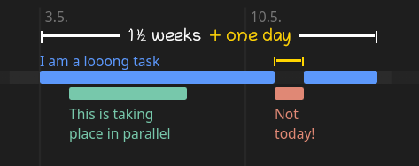

[](https://tineline.github.io/example.htm)

# Tineline 🕒

Tineline is a file format similar to [Markdown](https://daringfireball.net/projects/markdown/) for describing schedules, that will then be rendered in a horizontal timeline.

## About

The Tineline file format is powered by a single JavaScript file, [tl.js](tl.js).

Schedules consists of a single html file with a `<script>` tag in the last line. This tag runs the JavaScript on the file contents.


## Features

* Minimalistic syntax
* Flexible date / time specification
* Colors (auto by default, customizable)
* Fast rendering
* Live preview
* 'Today' is highlighted
  * Red line indicates current time of day
* Native horizontal scrolling
* Zooming

## Getting started

Let's have a look at the notation!

This is the source code of the timeline you see above:

```md
#timeline from 21.4.2021 for 1 months

* Be productive (2d 1.5w) orange

* Take a nap (11.5.) #eee !solo
* Finish Essay (5.5. 2d) #2ca

* Celebrate 🎉 (14.5. 19:00 24h) #f77
```

It is stored in a html file, let's call it `cake.htm`.

**Note**: In the real world, we need to put a script tag in the end of this file. This will be elaborated [later](#putting-it-all-together).

</br>

As the html file extension suggests, schedules can be displayed in any modern web browser (e.g. Chrome or Firefox).

For creating / editing schedules, any text editor can be used.

</br>

It is recommended to use an editor with integrated html preview, since this will allow to preview the resulting timeline live.

The recommended editor for Tineline schedules is [Visual Studio Code](https://code.visualstudio.com/) with the [HTML Preview extension](https://marketplace.visualstudio.com/items?itemName=tht13.html-preview-vscode). 

The next section will give a detailed overview over all features of the format.

</br>

## A Complete Guide

As you can see in the example above, schedule files begin by setting the starting date and duration of the timeline.

Instead of a duration, we could also give it a fixed ending date, like this:

```md
#timeline from 21.4.2021 until 21.5.2021
...
```

It's also possible to replace the words `from` and `until` and simply say:

```md
#timeline 21.4.2021 - 21.5.2021
...
```

### Tasks

Tasks or events are expressed as bullet points, indicated by a line starting with star (*), minus (-), tilde (~), or plus (+), depending on your taste.

The most basic task would look like this:

```md
* A task
```

In this scenario, we do not specify a duration or starting time for the task.

The system will automatically schedule the task after the previous one and allocate one day (1d) to it.

</br>

We have several options to elaborate the task. For example we can specify time and duration in `()` parenthesis:

```md
* I take two days (2d)
* I start on the 26th of November 2021 (26.11.2021)

* I start on the 28th and take one week (28.11.2021 1w)

* I start three days after the previous task and take 1 month (3d 1m)

* I finish on the 30th (25.11.2021 - 30.11.2021)
```

At this point you will have noticed that we don't use ISO 8601 formatted dates (2021-11-25). Instead, dates are specified in the [German date format](https://en.wikipedia.org/wiki/Date_and_time_notation_in_Europe#Germany).

This is intended by design for a very simple reason: It is very plesant to truncate this date style  
(also, considering natural language: [63.5% of all world countries](https://en.wikipedia.org/wiki/Date_format_by_country) use DMY order with `.`, `/`, or `-` as separator).


Example:

```md
* We already know this syntax            (14.11.2021)
* Short: Expressing November 17th        (17.11.)
* Even Shorter! Expressing November 19th (19.)

* Now Suddenly, December! (5.)
```

The last task will be placed in December, because the previous task was on the 19th of November.

5th of November would be before `<` the 19th, so the system assumes we mean the next month.

This also works with implied years, meaning if the next event would be set before the 5th of December, without specifying month and year, it would be moved to 2022.

### Time

Byond the starting date, it's possible to schedule tasks at a specific time:

```md
* I start at noon (24.11. 12:00)

* The same day, I take the whole evening (19:15 3h)

* I am a very important meeting (5.12. 14:30 - 16:00)
```

If no duration is given, events with a specified time will be allocated with one hour (1h).

### Color

By default the system will automatically pick some fresh colors for your schedule.

However, you may associate custom colors with each task! Color codes can be specified behind the parenthesis:

```md
* I'm looking fancy (2d) orange

* I'm feeling blue (1d) blue

* If you want to be extra fancy, this # also works (2h) #29f
```

### Working with long tasks

One last mechanic of the Tineline format is the `!solo` flag.

Tasks flagged as 'solo' will interrupt long tasks, that were specified _before_ them.

To retain flexibility, 'solo' tasks will not interrupt any task that was specified _after_ them (see [example.htm](example.htm)):



Source:

```md
#timeline from 21.4.2021 (1m)
* I am a looong task (3.5. 1.5w) blue

* This is taking place in parallel (4.5. 4d) green
* Not today! (11.5.) red !solo
```

Unless an end time was given, interrupted (long) tasks will automatically be extended by the duration of the 'solo' task,

meaning that: if the long event was supposed to take one month, it will exceed its previous end date in order to ensure it will still take one month, considering the interruption.

### Putting it all together

Last but not least schedules need to include [tl.js](tl.js), which contains all the logic for the file format.

This can be done by putting a `<script>` tag in the last line of the schedule file:

```md
...
<script src="tl.js"></script>
```

Given that we used the `.htm` file extension, the schedule can now be opened in any modern web browser.

[tl.js](tl.js) will read the contents of the file and render it in the form of a horizontal timeline.

Have a look at [example.htm](example.htm) and its rendered representation in the [online demo](https://tineline.github.io/example.htm) to see everything in action!

## Future plans

* Custom file extension for Tineline files (*.tl)
* A Visual Studio Code extension that supports:
  * Syntax highlighting for *.tl files  
    (for now, use Markdown highlighting)
  * Live Preview (based on existing HTML preview)

## Troubleshooting

### Visual Studio Code: Preview not working

Scripts on your local hard drive should be allowed by default in the HTML preview. If the preview is not working for you, you can try to change the preview security settings (CTRL+SHIFT+P > "Change Preview Security Settings" > "Disabled"). This should allow for [tl.js](tl.js) to be loaded.

---

Tineline – Lesosoftware 2021
